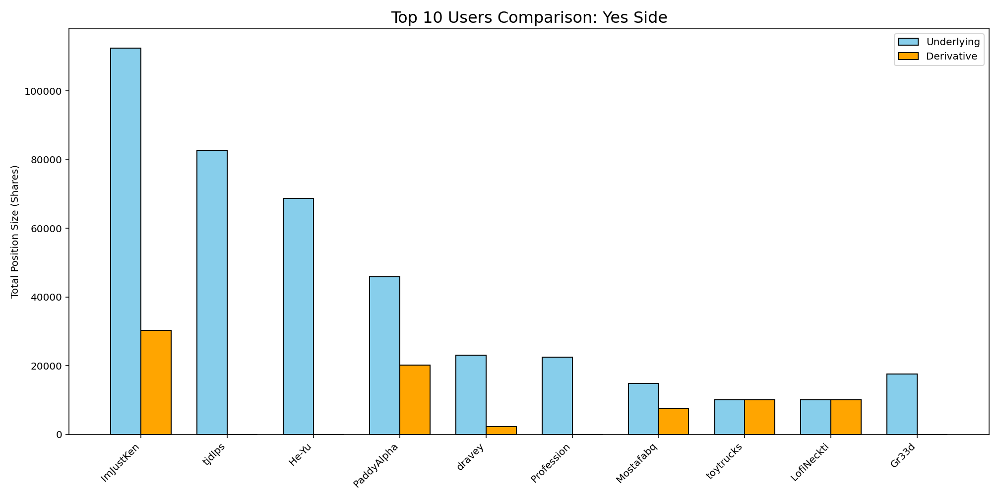
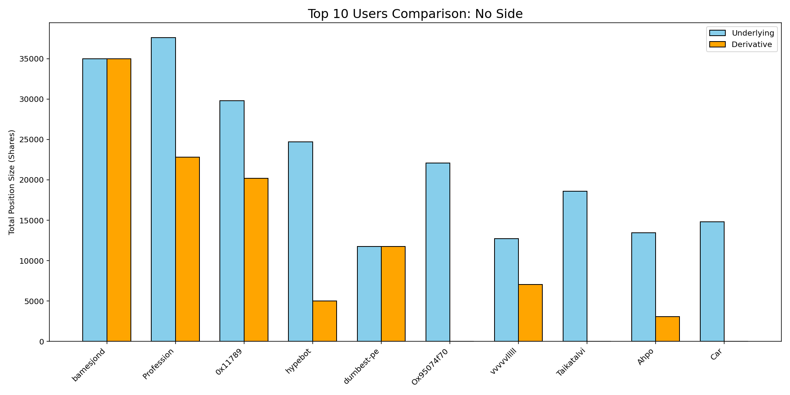
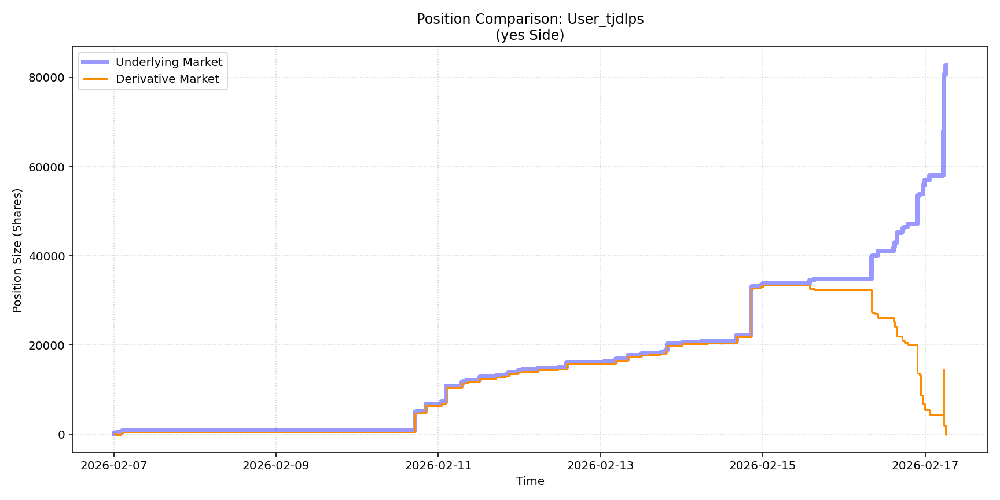
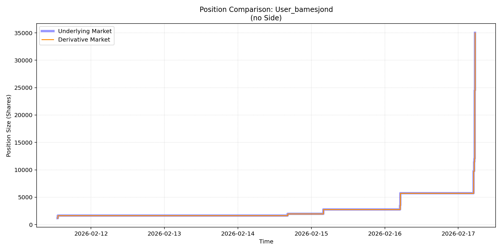
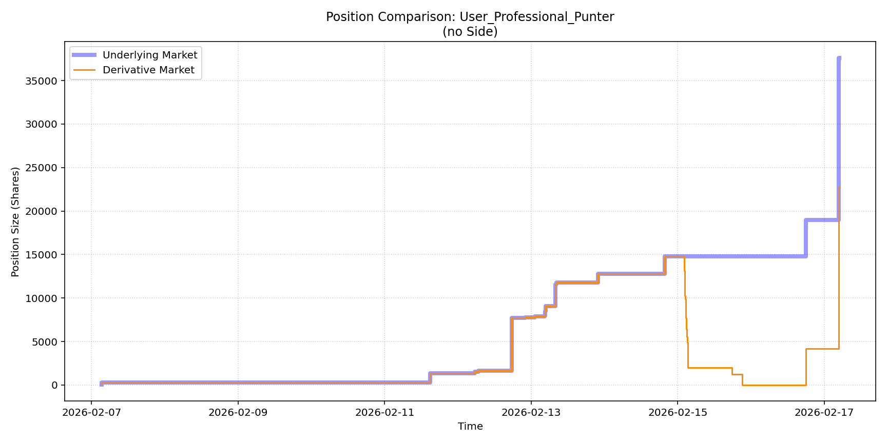

# What Happened in the Rapture Derivatives Market?

## Introduction

Polymarket is a blockchain based prediction market that has developed a reputation as a place where users can bet on anything. Available bets on the platform range from mundane questions such as “Will 'Emilia Pérez' win 1 Oscars at the 2025 Academy Awards?” to extreme questions such as “Iran Nuke by July 31?”. Recently, the news surrounding Polymarket has focused on incidents of insider trading such as one US soldier making $400,000 by betting on a operation he was taking part in. I started this repository to answer the question “Are people with insider information betting on the Iran war?”.

Shortly after beginning work on that project, I was sidetracked by a different equally pressing question; “Will Jesus Christ return before 2027?” People on Polymarket really are betting on whether the Rapture will occur this year.

On paper, this market should play out as follows:
No is a much safer bet than yes because the odds that Jesus returns this year are incredibly low. This is also what I like to call a “bigger problems bet” because if Jesus did return, you have bigger problems than losing money on Polymarket. Because of this risk profile there would be so much No demand that to buy a No share one would need to be willing to accept minimal returns. Conversely, there would be virtually no Yes demand as buying Yes shares would have an expected value that probably rounds to zero. The market would eventually reach an equilibrium where the return on a no share matches the opportunity cost of locking up one’s funds until market resolution. One would expect to see a stable but decreasing price as the resolution date draws nearer with minimal volume as there is little incentive to enter on the Yes side of the market.

In practice, this logic has not played out at all. The current trade volume for this market is $60,492,789 and in February of 2026 the price moved erratically between 2 and 5 cents per yes share. It was clear that something beyond the predicted odds of the return of Christ was influencing the market. One suspect, a derivative market asking the question “Jesus Christ return before 2027 Odds >5% February 17, 12-1 AM?”, could plausibly have traders influencing the price in the underlying market to get their bet in the derivative market to hit. Therefore, the question of this repository shifted to the following: “Are traders on Polymarket buying shares in the underlying Rapture market to influence its price so that their bet in the derivative market hits?”

## Data Source

This analysis was conducted using data from Polymarket’s API. As of April 2026, none of the API endpoints used in this project required an API key.

## Scripts

### Collect
This module is designed to collect data from Polymarket’s API and build out a database. This module must be run prior to the analyze module. For more information on how this module works, see the readme in the collect folder.

### Analyze
This module is designed to analyze the data collected in the previous module and create visualizations. It is designed to be run after the collect module. For more information on how this module works, see the readme in the analyze folder.

## Analysis:

The dataset produced for this analysis contained a total of 1324 unique wallets who participated in the derivative market. Of those wallets, 385 or 29% of them also participated in the underlying market. This figure only counts wallets that participated in both markets and does not include users who participated in both using different wallets. This means that this figure is likely an undercount but it is impossible to ascertain by how much.

The derivative market had a total outstanding token count of 347,892 at the time of resolution split evenly between yes and no shares. At the time of the resolution of the derivative market at 1 am, February 17, users in the derivative market owned 1,012,551 shares in the underlying market.

The volume was split between yes and no as follows:
* Total volume for yes: 558141
* Total volume for no: 454409

This is notable as users staked out considerably larger positions in the underlying market compared to their positions in the derivate.

### Yes vs. No

It is also noteworthy that there were people on both the yes and no side of the derivative market trying to manipulate the underlying market into their favor with logic to support taking either side of the market.

For the Yes side, the price of Yes shares in the underlying market was considerably cheaper than the price of No making it easier to stake out a larger position at a cheaper price. Additionally, the shares of Yes in the derivative market were also cheaper, meaning that if successful yes wallets would earn more money. The downside of this angle is that they are guaranteed to lose money on their shares in the underlying market as the price will crater once they stop manipulating it. These losses put a hard cap on the number of underlying shares a user can buy as at some point the money lost in the underlying market will exceed the money gained in the derivative market.

For the No side, the upside is that No shares in the underlying market are guaranteed to make money meaning that the only limiting factor to the amount of shares a user can buy is the amount of capital they can expend. This means that the No side of the derivative market is less risky leading to a reduced return in the derivative market as well. Additionally, No shares in the underlying market were much more expensive which made staking out a large position to manipulate the price much more capital intensive.

Ultimately, the Yes side was unable to raise the price high enough to break the 5% threshold and the No side prevailed.

### Top Holders

The bar charts below show the top ten holders who participated in both markets and the size of their positions at the time that the derivative market resolved at 1 am, February 17.

The large positions in the underlying market of users on the Yes chart demonstrates the fact that it was easier to buy more Yes shares due to the lower cost per share. This is especially illustrated by the user ImJustKen who had purchased over 100,000 yes shares just before the market resolved. Meanwhile, the positions on the No side are much more modest with user bamesjond holding the largest position at around 35,000 shares. This reflects the higher price per share of the No side of the underlying market.

Additionally, some users are shown as having no shares in the derivative market on these graphs. This is because these users sold or otherwise exited their positions in the derivative market prior to resolution. This is more common on the Yes side as it became apparent that the No side was going to win and users attempted to cut their losses.

### User Profiles: Yes Side

The below graph shows the position history for the User ImJustKen in the week leading up to the resolution of the derivative market.

ImJustKen is unique because rather than trying to simply manipulate the underlying asset price for the resolution data, he instead buys large amounts of the underlying assets to raise the value of his derivative positions before selling. He is shown on this graph doing this on both 2/11 and 2/16.

The next graph shows the position history for user tjldps in the same week. 

This graph shows that tjldps bought shares in both markets at the same time, only deviating when the resolution date drew closer and it likely became apparent that the Yes side would not win.

### User Profiles: No Side

The below graphs show the positions for users bamesjond and professionalpunter in both markets in the week leading up to the resolution of the derivative market.

These charts show that these users bought shares in the derivative and underlying market at the same time, likely as efforts to manipulate the price. The largest effort of manipulation came at the end of the graph where both users bought large positions in the underlying market in order to ensure that the odds did not go above 5%.

## Conclusions

This repository clearly shows that users who were betting in the derivative market were also betting in the underlying market to manipulate the price of the market. Polymarket advertises its utility as providing accurate odds on the outcomes of certain events. However, this analysis demonstrates that Polymarket is a financial market, and the incentive of its users is not to provide accurate odds on the outcomes of world events but to make money. If the financial incentives of the market deviate from setting accurate odds on the outcome of an event then the odds provided by that market will no longer be useable. This means that there are a lot of omitted variables moving the odds on Polymarket and individuals should use caution when using the odds on Polymarket to predict the likelihood of an event occurring.

Additionally, this analysis proves that Polymarket is unique amongst financial markets in that one can collect all of the transactions for an entire market. While Polymarket is not a one to one comparison for traditional financial markets, the ability to see every single transaction that occurs and attribute it to specific wallets could make it an interesting research venue into certain behaviors in financial markets.

Finally, the primary purpose of this repository was to build out a strong foundation for future analysis into Polymarket. This is why this repository opts for a database to store transactions and pulls all tags on Polymarket for the tags table. This repository hopefully displays the power of these tools in collecting, storing, and analyzing data for future research into Polymarket.
